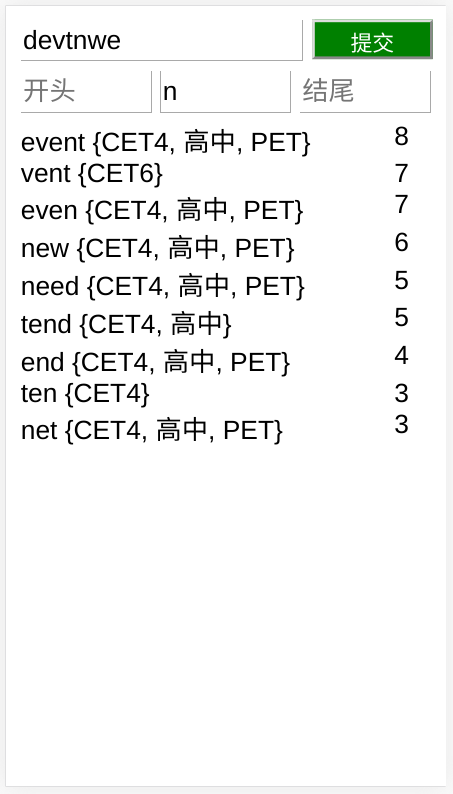

# Scrabble Cheat

A simple Scrabble cheat program.

Scrabble: https://en.wikipedia.org/wiki/Scrabble

English:

When I played Scrabble with my daughter, I found that there was no good cheat/assistant software on the iPad (but Android does), so I wrote a simple web version of the cheat program so that she could use it via browser on the iPad.

Chinese:

最近在和女儿玩Scrabble，但是女儿的iPad却没有好用的作弊（辅助）工具软件，所以自己用Python做了一个简单的WEB版本，这样她通过浏览器就可以玩了。

Requirement:

	sudo apt install python3-tornado

Download:

	git clone https://github.com/gzhechu/scrabblecheat.git --depth=1

Issues:

You shoud set your system locales to UTF-8 to avoid the decode problem when load word list. For example: 

	export LC_ALL="en_US.UTF-8"
	export LC_CTYPE="en_US.UTF-8"

User Interface:

